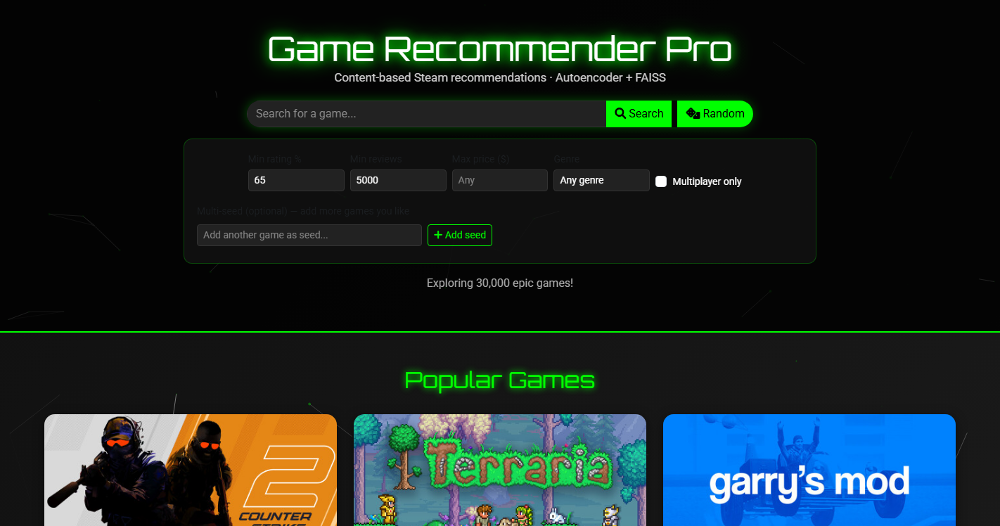
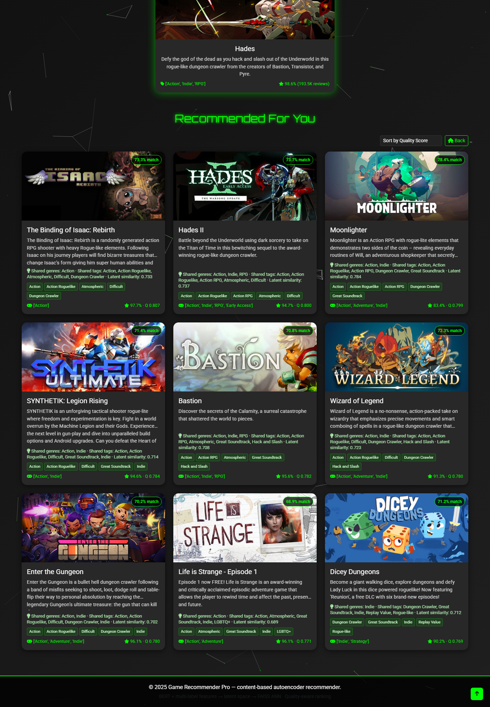
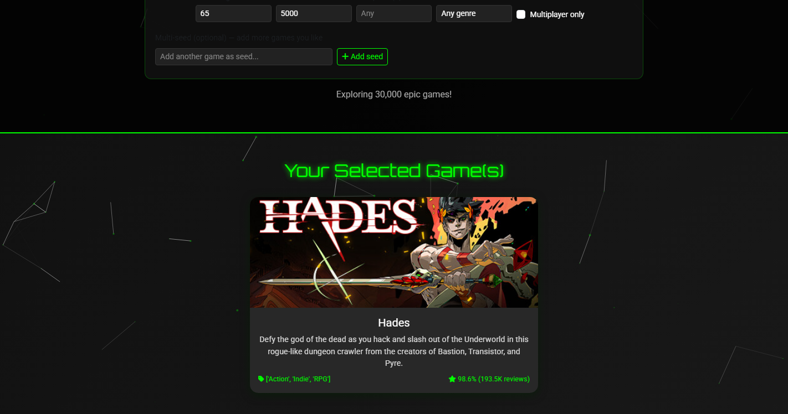
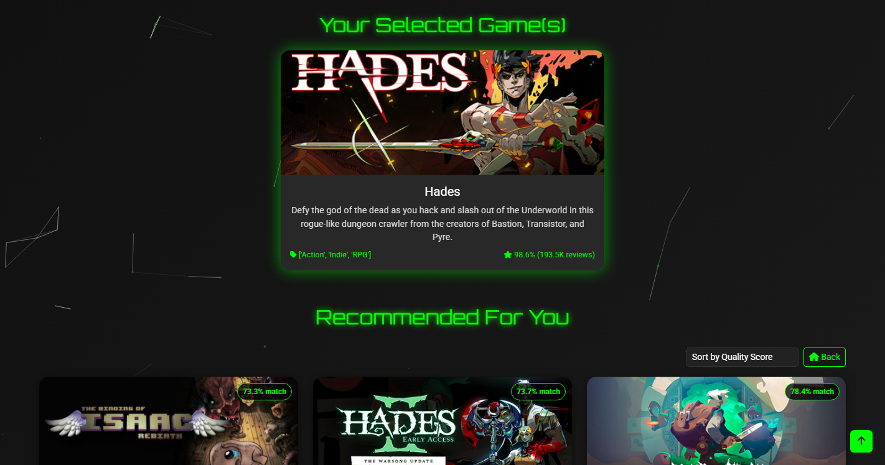

# Game Recommendation System

End-to-end **content-based** Steam game recommender: multi-label metadata + BERT description embeddings → deep autoencoder latent space → FAISS nearest neighbors with quality-aware ranking, explanations, and filters.

> **Scope note:** The public dataset has game metadata only (no user–item interactions), so collaborative filtering is out of scope. The system is deliberately content-based and evaluated against strong content baselines.

---

## Highlights

| Area | What you get |
|------|----------------|
| Features | Genres / Tags / Categories (multi-hot) + BERT `bert-base-uncased` [CLS] embeddings |
| Model | Deep autoencoder `1289 → 1024 → 512 → 256 → 128` (PyTorch) |
| Retrieval | L2-normalized latent cosine via **FAISS IndexFlatIP** (numpy fallback) |
| Ranking | `score = 0.7 × similarity + 0.3 × positive_ratio` + review/rating filters |
| Explain | Shared genres/tags + latent similarity + community rating |
| Product | Flask API + UI (search, multi-seed, genre/price/MP filters), CLI |
| Quality | Unit tests, offline evaluation script, Docker, GitHub Actions CI |

---

## Architecture

```
Steam metadata (≈30k games)
        │
        ▼
 MultiLabel(genres, tags, categories)  +  BERT(description)
        │
        ▼
 Weighted concat → MinMaxScaler → feature ∈ R^1289
        │
        ▼
 Autoencoder encoder → latent z ∈ R^128
        │
        ▼
 FAISS / cosine ANN → quality re-rank → filters → explanations
        │
        ▼
 Flask API  ·  Web UI  ·  CLI
```

**Multi-seed:** average raw latents of selected games, re-normalize, then search.

**Cold-start encode (optional):** `POST /recommend_encode` builds features with BERT + MLBs + scaler, encodes with the trained AE, then retrieves neighbors (requires `transformers`).

---

## Project structure

```
├── app.py                 # Flask routes
├── cli_recommender.py     # CLI interface
├── config.py              # Paths & defaults
├── Colab_Train.ipynb      # Training notebook (Google Colab)
├── requirements.txt
├── Dockerfile
├── docker-compose.yml
├── utils/
│   ├── model.py           # Autoencoder (matches best_model.pth)
│   ├── features.py        # Feature build + online encode
│   ├── recommender.py     # Engine: FAISS, filters, explain
│   ├── metrics.py         # Precision@K, NDCG, diversity, …
│   └── parsing.py
├── scripts/
│   ├── evaluate.py        # Offline eval vs baselines
│   └── build_index.py     # Persist FAISS index
├── tests/                 # Unit tests (synthetic fixtures)
├── templates/ / static/   # Web UI
└── data/                  # Artifacts (see Setup)
```

---

## Dataset & artifacts

- **Source dataset (Drive):** https://drive.google.com/file/d/1XyYrLodKYIgrWhpDpU2lIAwq9KPv0gKz/view?usp=sharing  
- Place processed artifacts under `data/`:

| File | Role |
|------|------|
| `processed_games.csv` | Game metadata (~30k rows) |
| `latent_reps.npy` | Precomputed latents `(N, 128)` |
| `best_model.pth` | Trained autoencoder weights |
| `feature_info.pkl` | Dims & feature weights |
| `scaler.pkl` | MinMaxScaler |
| `mlb_genres.pkl` / `mlb_tags.pkl` / `mlb_categories.pkl` | MultiLabel binarizers |

---

## Setup

### Prerequisites

```bash
python -m venv .venv
# Windows: .venv\Scripts\activate
# Linux/macOS: source .venv/bin/activate
pip install -r requirements.txt
```

Optional cold-start NLP stack:

```bash
pip install transformers
```

### Run web app

```bash
python app.py
# → http://localhost:5000
```

### CLI

```bash
python cli_recommender.py "Counter-Strike: Global Offensive"
python cli_recommender.py "Hades" "Dead Cells" -k 5 --genre Action
python cli_recommender.py "Dota 2" --json --min-rating 0.7
```

### Docker

```bash
docker compose up --build
```

---

## API

| Method | Endpoint | Description |
|--------|----------|-------------|
| GET | `/health` | Status, catalog size, FAISS flag |
| GET | `/game_names` | All titles (autocomplete) |
| GET | `/genres` | Genre list for filters |
| POST | `/get_game_info` | `{ "game_name": "..." }` |
| POST | `/recommend` | Seeds + filters → ranked list + explanations |
| POST | `/recommend_encode` | Cold-start from free-form metadata |
| GET | `/popular_games?num=20` | Popularity ranking |
| GET | `/random_game` | Random from top-reviewed |
| GET | `/search?q=&limit=10` | Name search |

### Example recommend body

```json
{
  "game_names": ["Hades", "Dead Cells"],
  "num_recommendations": 9,
  "min_reviews": 5000,
  "min_rating": 0.65,
  "genres": ["Action"],
  "max_price": 40,
  "multiplayer_only": false
}
```

Each result includes `Similarity`, `Quality Score`, and `explanation` (`shared_genres`, `shared_tags`, `summary`).

---

## Screenshots

### Home — search, filters, popular games



### Recommendations — match %, explanations, shared tags

Query example: **Hades**



<details>
<summary>More screenshots</summary>





</details>

---

## Model (training)

Open `Colab_Train.ipynb` in Google Colab.

- **Encoder:** Linear 1289→1024→512→256→128 + BatchNorm + LeakyReLU + Dropout  
- **Decoder:** reverse with Sigmoid output  
- **Loss:** MSE reconstruction · AdamW · ReduceLROnPlateau · early stopping  
- **Export:** `latent_reps.npy`, `best_model.pth`, scalers/MLBs

Default ranking: `score = similarity × 0.7 + positive_ratio × 0.3`, with default filters `min_reviews ≥ 5000`, `min_rating ≥ 0.65`.

---

## Evaluation

Proxy ground truth = high **tag/genre Jaccard** overlap (appropriate when no click logs exist).

```bash
python scripts/evaluate.py --sample 100 --k 10
```

### Sample results (100 queries, K=10, seed=42)

| Method | P@10 | NDCG@10 | Diversity | Latency (ms) |
|--------|------|---------|-----------|--------------|
| popular | 0.003 | 0.004 | 0.86 | ~10 |
| tfidf_desc | 0.040 | 0.056 | 0.84 | ~31 |
| **raw_multihot** | **0.919** | **0.938** | 0.51 | ~3 |
| autoencoder_cosine | 0.355 | 0.394 | **0.70** | **~1** |
| autoencoder_quality (product) | 0.300 | 0.334 | 0.73 | ~4 |

Report → `data/evaluation_report.json`.

### How to read this (important for interviews)

- Proxy labels are **built from the same tag/genre signal** as `raw_multihot`, so multi-hot is essentially an **upper bound** on this metric — not a fair “model vs model” fight for production quality.
- The autoencoder still **beats popularity and TF-IDF by a large margin**, compresses everything to **128-d** (fast FAISS ANN), **fuses BERT text + structured tags**, and yields **higher list diversity** than pure multi-hot (less near-duplicate tag clones).
- `autoencoder_quality` is the **product ranker** (similarity + rating prior + review filters). It trades a bit of proxy P@10 for better-rated, trustworthy titles — which is what users actually want.
- Real online metrics (CTR, dwell) would be the next step if interaction logs exist.

---

## Tests

```bash
pytest
```

Tests use a tiny synthetic catalog (no need for the full 30k CSV in CI).

---

## UI features

- Autocomplete search + random game  
- Filters: min rating, min reviews, max price, genre, multiplayer  
- **Multi-seed** chips (blend several liked games)  
- Recommendation cards show **match %**, quality score, and **why** (shared tags/genres)  
- Sort by quality / similarity / rating / reviews  

---

## Design decisions & limitations

**Why content-based only?**  
No user interaction matrix in the dataset. Building fake CF would be less honest than a solid content system with measurable baselines.

**Why an autoencoder?**  
Compresses heterogeneous features (sparse multi-hot + dense BERT) into a compact metric space for ANN and multi-seed averaging.

**Limitations**

- Filter bubble / metadata bias (tags are crowd-sourced)  
- Popularity skew still influences quality term  
- Proxy metrics ≠ real user satisfaction  
- Cold-start encode loads BERT (heavy); precomputed latents cover the catalog  
- No personalization without a user history  

**Natural extensions:** contrastive fine-tuning on series/developer pairs, session-based multi-seed from clickstream, hybrid CF if interactions become available.

---

## License / academic use

Personal / academic portfolio project. Steam trademarks and game assets belong to their respective owners; metadata used for research/demo only.
